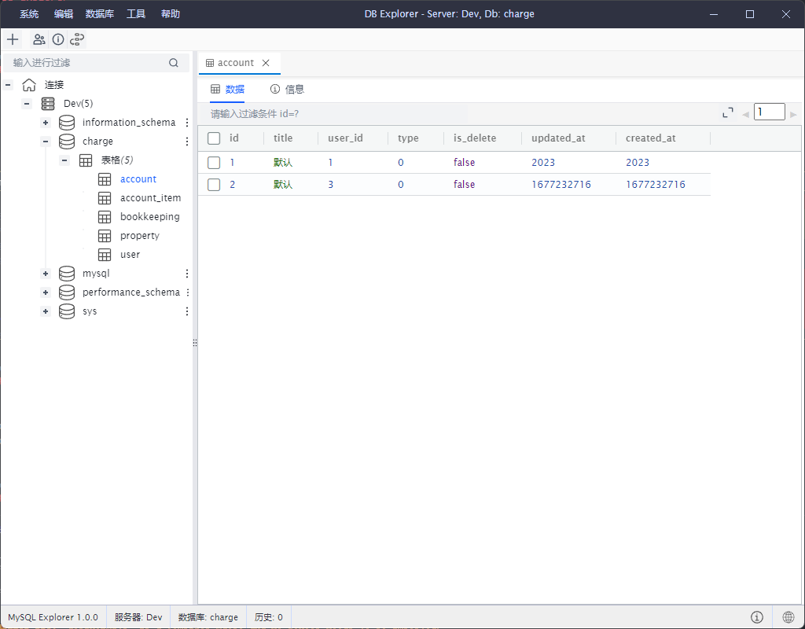

# DB Explorer

这个是一个使用 Electron + Vue3 + Vite + Arco-design 实现的一个 DB 管理工具. 尽可能的实现简单高效, 加上的都是我之前工作中需要用到的功能. 还是在不断改进中. 希望有更多的朋友可以加入开发.



## Features

- SQL 编辑, 查询, 支持自动提示. 支持历史记录
- 数据查看, 编辑, 过滤等基本操作, 支持大量数据查看
- 数据库管理, 表格设计, 数据备份, 数据恢复
- 用户管理, 进程管理, 表结构同步
- 更多还需要再发掘

## Quick Start

```sh
npm i
npm run dev
```

## Debug

Visual Studio Code suppert Run & Debug

## Directory

```
  ├─┬ electron
  │ ├─┬ main
  │ │ └── index.ts    entry of Electron-Main
  │ └─┬ preload
  │   └── index.ts    entry of Preload-Scripts
  ├─┬ src
  │ └── assets        entry of Renderer resources
  │ └── components    entry of Vue custom components
  │ └── locale        entry of Locale language file
  │ └── node-ipc      entry of Node IPC Renderer
  │ └── store         entry of Vue store base pinia
  │ └── store         entry of util tool
  │ └── main.ts       entry of Electron-Renderer
  ├── index.html
  ├── package.json
  └── vite.config.ts
```

